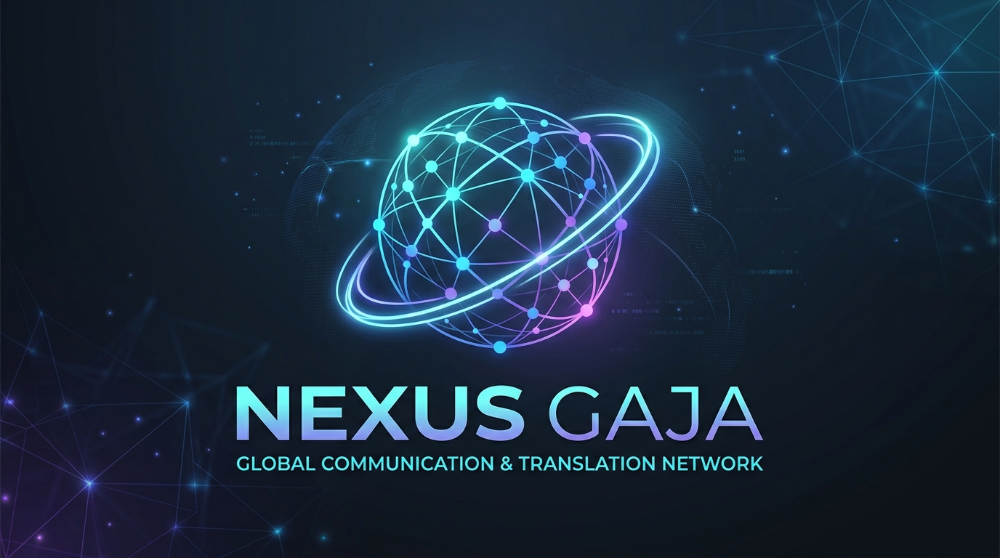
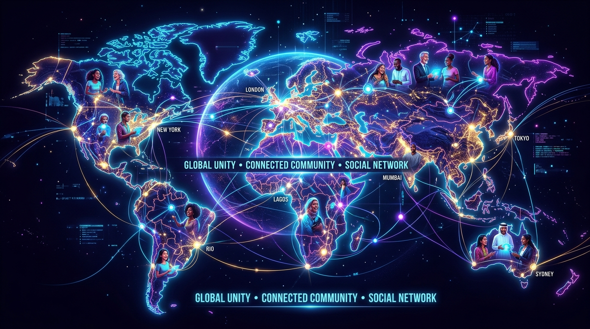
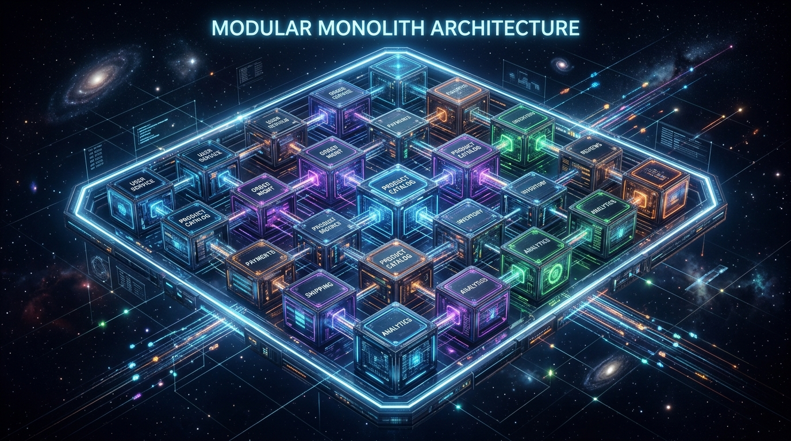

# Nexus Gaja

> *Pour la paix mondiale et la compréhension mutuelle*





<br>
[](https://github.com/SonnerStudio/Nexus_Gaja/blob/main/assets/video/Nexus_Gaja_TikTok_EN.mp4)

<details>
<summary>🌍 Available in 201 Languages & Regions (Click to expand)</summary>

[English](README.md) | [Deutsch](README.de.md) | [Türkçe](README.tr.md) | [Español](README.es.md) | [中文](README.zh.md) | [Français](README.fr.md) | [Italiano](README.it.md) | [Português](README.pt.md) | [Nederlands](README.nl.md) | [Русский](README.ru.md) | [日本語](README.ja.md) | [한국어](README.ko.md) | [العربية](README.ar.md) | [हिन्दी](README.hi.md) | [বাংলা](README.bn.md) | [Polski](README.pl.md) | [Bahasa Indonesia](README.id.md) | [Tiếng Việt](README.vi.md) | [ไทย](README.th.md) | [فارسی](README.fa.md) | [Українська](README.uk.md) | [Čeština](README.cs.md) | [Ελληνικά](README.el.md) | [Magyar](README.hu.md) | [Svenska](README.sv.md) | [Română](README.ro.md) | [Dansk](README.da.md) | [Suomi](README.fi.md) | [Norsk](README.no.md) | [Slovenčina](README.sk.md) | [Hrvatski](README.hr.md) | [Български](README.bg.md) | [Српски](README.sr.md) | [Lietuvių](README.lt.md) | [Latviešu](README.lv.md) | [Eesti](README.et.md) | [Slovenščina](README.sl.md) | [עברית](README.he.md) | [Kiswahili](README.sw.md) | [አማርኛ](README.am.md) | [اردو](README.ur.md) | [मराठी](README.mr.md) | [తెలుగు](README.te.md) | [தமிழ்](README.ta.md) | [ગુજરાતી](README.gu.md) | [ಕನ್ನಡ](README.kn.md) | [മലയാളം](README.ml.md) | [ਪੰਜਾਬੀ](README.pa.md) | [Basa Jawa](README.jv.md) | [Bahasa Melayu](README.ms.md) | [Tagalog](README.tl.md) | [Oʻzbekcha](README.uz.md) | [Қазақша](README.kk.md) | [Azərbaycanca](README.az.md) | [ქართული](README.ka.md) | [Հայերեն](README.hy.md) | [ភាសាខ្មែរ](README.km.md) | [සිංහල](README.si.md) | [नेपाली](README.ne.md) | [isiZulu](README.zu.md) | [Afrikaans](README.af.md) | [Shqip](README.sq.md) | [Македонски](README.mk.md) | [Íslenska](README.is.md) | [Cymraeg](README.cy.md) | [Euskara](README.eu.md) | [Galego](README.gl.md) | [Malti](README.mt.md) | [Беларуская](README.be.md) | [Монгол](README.mn.md) | [Soomaali](README.so.md) | [Hausa](README.ha.md) | [Yorùbá](README.yo.md) | [Igbo](README.ig.md) | [isiXhosa](README.xh.md) | [Basa Sunda](README.su.md) | [Malagasy](README.mg.md) | [Ikinyarwanda](README.rw.md) | [Chichewa](README.ny.md) | [chiShona](README.sn.md) | [Kurdî](README.ku.md) | [پښتو](README.ps.md) | [سنڌي](README.sd.md) | [ଓଡ଼ିଆ](README.or.md) | [অসমীয়া](README.as.md) | [Bosanski](README.bs.md) | [ລາວ](README.lo.md) | [မြန်မာ](README.my.md) | [Тоҷикӣ](README.tg.md) | [Türkmençe](README.tk.md) | [繁體中文](README.zh-tw.md) | [Català](README.ca.md) | [Bisaya](README.ceb.md) | [Кыргызча](README.ky.md) | [ئۇيغۇرچە](README.ug.md) | [Afaan Oromoo](README.om.md) | [Lingála](README.ln.md) | [Luganda](README.lg.md) | [Twi](README.ak.md) | [Sesotho](README.st.md) | [Sesotho sa Leboa](README.nso.md) | [ትግርኛ](README.ti.md) | [Bamanankan](README.bm.md) | [भोजपुरी](README.bho.md) | [मैथिली](README.mai.md) | [डोगरी](README.doi.md) | [संस्कृतम्](README.sa.md) | [कोंकणी](README.gom.md) | [মৈতৈলোন্](README.mni.md) | [Runa Simi](README.qu.md) | [Avañe'ẽ](README.gn.md) | [Aymar aru](README.ay.md) | [Kreyòl Ayisyen](README.ht.md) | [Esperanto](README.eo.md) | [Latina](README.la.md) | [ייִדיש](README.yi.md) | [Gaeilge](README.ga.md) | [کوردی (Sorani)](README.ckb.md) | [Gagana fa'a Sāmoa](README.sm.md) | [Татарча](README.tt.md) | [Corsu](README.co.md) | [ދިވެހި](README.dv.md) | [Eʋegbe](README.ee.md) | [Frysk](README.fy.md) | [ʻŌlelo Hawaiʻi](README.haw.md) | [Hmoob](README.hmn.md) | [Ilokano](README.ilo.md) | [Krio](README.kri.md) | [Lëtzebuergesch](README.lb.md) | [Māori](README.mi.md) | [Mizo](README.lus.md) | [Gàidhlig](README.gd.md) | [Xitsonga](README.ts.md) | [ᚱᚢᚾᛖᛋ (Futhark)](README.runes.md) | [Español (Argentina)](README.es-AR.md) | [Español (Bolivia)](README.es-BO.md) | [Español (Chile)](README.es-CL.md) | [Español (Colombia)](README.es-CO.md) | [Español (Costa Rica)](README.es-CR.md) | [Español (Cuba)](README.es-CU.md) | [Español (República Dominicana)](README.es-DO.md) | [Español (Ecuador)](README.es-EC.md) | [Español (El Salvador)](README.es-SV.md) | [Español (Guatemala)](README.es-GT.md) | [Español (Honduras)](README.es-HN.md) | [Español (México)](README.es-MX.md) | [Español (Nicaragua)](README.es-NI.md) | [Español (Panamá)](README.es-PA.md) | [Español (Paraguay)](README.es-PY.md) | [Español (Perú)](README.es-PE.md) | [Español (Puerto Rico)](README.es-PR.md) | [Español (Uruguay)](README.es-UY.md) | [Español (Venezuela)](README.es-VE.md) | [Español (Guinea Ecuatorial)](README.es-GQ.md) | [English (Australia)](README.en-AU.md) | [English (Canada)](README.en-CA.md) | [English (India)](README.en-IN.md) | [English (Ireland)](README.en-IE.md) | [English (Jamaica)](README.en-JM.md) | [English (New Zealand)](README.en-NZ.md) | [English (South Africa)](README.en-ZA.md) | [English (UK)](README.en-GB.md) | [English (USA)](README.en-US.md) | [English (Belize)](README.en-BZ.md) | [English (Nigeria)](README.en-NG.md) | [English (Kenya)](README.en-KE.md) | [English (Singapore)](README.en-SG.md) | [English (Philippines)](README.en-PH.md) | [Français (Canada)](README.fr-CA.md) | [Français (Belgique)](README.fr-BE.md) | [Français (Suisse)](README.fr-CH.md) | [Français (Sénégal)](README.fr-SN.md) | [Français (Côte d'Ivoire)](README.fr-CI.md) | [Français (Cameroun)](README.fr-CM.md) | [Français (Mali)](README.fr-ML.md) | [Français (RDC)](README.fr-CD.md) | [Français (Madagascar)](README.fr-MG.md) | [Français (Haïti)](README.fr-HT.md) | [Português (Brasil)](README.pt-BR.md) | [Português (Angola)](README.pt-AO.md) | [Português (Moçambique)](README.pt-MZ.md) | [Português (Cabo Verde)](README.pt-CV.md) | [Deutsch (Österreich)](README.de-AT.md) | [Deutsch (Schweiz)](README.de-CH.md) | [Deutsch (Liechtenstein)](README.de-LI.md) | [Deutsch (Luxemburg)](README.de-LU.md) | [Nederlands (België)](README.nl-BE.md) | [Nederlands (Suriname)](README.nl-SR.md) | [العربية (مصر)](README.ar-EG.md) | [العربية (السعودية)](README.ar-SA.md) | [العربية (الإمارات)](README.ar-AE.md) | [العربية (المغرب)](README.ar-MA.md) | [العربية (الجزائر)](README.ar-DZ.md) | [العربية (العراق)](README.ar-IQ.md) | [العربية (سوريا)](README.ar-SY.md) | [العربية (لبنان)](README.ar-LB.md) | [العربية (الأردن)](README.ar-JO.md) | [العربية (اليمن)](README.ar-YE.md) | [中文 (新加坡)](README.zh-SG.md) | [繁體中文 (香港)](README.zh-HK.md) | [繁體中文 (澳門)](README.zh-MO.md)

</details>

**Nexus Gaja** est un réseau de communication intelligent et contextuel conçu pour révolutionner la communication mondiale.

## Objectif et vision


Dans un monde globalisé, la langue constitue souvent le plus grand obstacle. L'objectif principal de Nexus Gaja est de permettre une communication transparente, sans obstacle et contextuellement précise entre les personnes, qu'elles parlent ou non une langue commune.

Il ne s'agit pas seulement de traduire des mots de manière rigide, mais de **transférer du sens**. Nexus Gaja connecte les gens à un niveau plus profond en comprenant les nuances culturelles, régionales et contextuelles, permettant ainsi des conversations véritables et authentiques.

## Possibilities and Features
- **Multimedia Communication**: The system processes not just text, but also image, audio, and video. This allows for fully immersive conversations (e.g., video calls or voice messages) in real-time across language barriers.
- **Context Sensitivity**: Recognition of irony, idioms, jargon, and regional dialects that are often misunderstood by conventional translators.
- **Cross-Platform Network**: Serves as a foundation for private chats, forum threads (posts with comments), and global community interactions.

---

## Architecture technique (concept de base)


Le noyau technique de Nexus Gaja est un modèle de communication personnalisé strictement divisé en trois couches :

1. **Original** : L'objet de communication (message) créé par l'expéditeur reste toujours immuable.
2. **Interprétation sémantique** : Le système analyse non seulement les mots, mais aussi leur signification réelle.
3. **Représentation dans la langue cible** : l'IA crée simplement une représentation temporaire ou mise en cache de l'original pour le destinataire respectif en fonction de sa langue préférée. Les traductions n’écrasent jamais le message original.

### Context Dependency
Translations in Nexus Gaja never view messages in isolation. The engine considers the entire hierarchy:
`Message` → `Previous Messages` → `Thread Context` → `Community Context` → `Language / Region` → `User Preferences`

### Efficacité grâce à la traduction à la demande
La traduction s'effectue de manière efficace en termes de ressources uniquement **sur demande** (à la demande). Lorsqu'un utilisateur demande du contenu, celui-ci est traduit dans sa langue prédéfinie. Une fois qu'une traduction pour une langue spécifique est générée, elle est stockée en permanence (mise en cache) pour accélérer considérablement les demandes futures.

## Modération assistée par l'IA (WP 1.8.4)


Avec la modération assistée par l'IA, nous franchissons une étape importante de l'idée du produit à l'architecture technique, en tenant compte des réglementations européennes en vigueur (exigences de transparence de la loi européenne sur l'IA en vertu de l'article 50 ; loi sur les services numériques avec justifications compréhensibles et possibilités de recours).

### 1. Basic Principle
The most important sentence for the architecture is: **The moderation AI is a review system, not an autonomous ruling system.**
It is designed to assist humans in moderation, not to determine itself which opinions are allowed to exist on Nexus Gaja.
We differentiate between three levels:
- **Detection:** "There could be a rule violation here."
- **Evaluation:** "The probability of a rule violation is, for example, 94%."
- **Decision:** "What action is actually taken?"
The third level must be controlled by a human in severe cases.

### 2. L'IA de modération en tant que sous-système
Au lieu d’une seule IA, un sous-système robuste est établi :
```texte
                 MODÉRATION DE L'IA NEXUS GAJA
                          │
       ┌──────────────────┼──────────────────┐
       │ │ │
  IA de langage IA de sécurité IA de fraude
       │ │ │
       ├──────────────┬───┴──────────────┬───┤
       │ │ │
 Identité du comportement de traduction
 Signaux d'analyse d'analyse
       │ │ │
       └──────────────┼──────────────────┘
                      â–¼
               Évaluation des risques
                      │
                      â–¼
               Examen humain
```

### 3. Les modules d'IA les plus importants
Nexus Gaja utilise neuf domaines d'analyse spécialisés :
- **M1 – Compréhension du langage** : Détecte la langue, le dialecte, l'argot, les indicateurs d'ironie, les problèmes de traduction.
- **M2 – Détection Toxicité / Abus** : Détecte les insultes, les attaques personnelles, le harcèlement.
- **M3 – Détection des menaces** : Détecte les menaces potentielles, le chantage, les annonces de violence.
- **M4 – Détection de haine/déhumanisation** : Détecte les attaques ciblées contre des personnes en fonction d'affiliations spécifiques.
- **M5 – Détection de spam/manipulation** : Détecte le spam, le comportement des robots et les manipulations coordonnées.
- **M6 – Fraud Detection** : Détecte les tentatives de fraude suspectes, le phishing, l'ingénierie sociale.
- **M7 – Intégrité de l'identité** : Vérifie les signaux concernant les piratages de comptes, les comptes multiples, l'évasion d'interdiction.
- **M8 – Media Safety** : Analyse les images, l'audio, la vidéo, les documents.
- **M9 – Context Engine** : Le module le plus important. Il fusionne les résultats individuels.

### 4. Pourquoi le moteur contextuel est crucial
Une simple recherche par mots-clés serait insuffisante. "Je pourrais le tuer en riant" contient sémantiquement de la violence mais est une figure de style. "Demain à 20 heures, je lui tirerai dessus devant sa maison" est une situation complètement différente. L'IA doit comprendre ce que signifie la déclaration dans son contexte spécifique.

### 5. Modération multilingue
La modération ne peut pas simplement comparer les mots. Il doit analyser le niveau sémantique (par exemple, idiomes allemands, idiomes japonais et expressions régionales).

### 6. Langue originale + traduction
L'original et la traduction sont analysés séparément. Ce n'est qu'à ce moment-là qu'a lieu l'« évaluation de modération combinée ». Cela permet à Nexus Gaja de déterminer si la traduction elle-même a pu aggraver ou modifier les faits.

### 7. Score de confiance
Chaque évaluation de l'IA reçoit un score de confiance (par exemple, probabilité de menace : 0,96). Cependant : **Score de confiance ≠ Vérité.** Un score de 96 % signifie uniquement que le modèle est très certain de sa classification, pas nécessairement que l'utilisateur est coupable.

### 8. L'incertitude devient elle-même un signal
Si l’IA est incertaine (par exemple Menace : 0,62, Satire : 0,54), elle ne doit pas simplement appliquer des règles strictes. Au lieu de cela, l'incertitude est directement intégrée à l'architecture : **Examen humain requis**.

### 9. Quatre zones de décision
- 🟢 **VERT** : Très probablement conforme. → aucune action.
- 🟡 **JAUNE** : Violation possible. → surveiller / avertir si nécessaire.
- 🟠 **ORANGE** : Violation probable. → avis de modération.
- 🔴 **ROUGE** : Violation grave possible. → mesure de protection immédiate + examen humain.

### 10. Pas de « punition IA »
**L'IA n'impose aucune sanction finale.** Elle peut déclencher des mesures techniques immédiates (par exemple, retenir temporairement un message) en cas de graves problèmes de sécurité, mais la décision finale reste vérifiable.

### 11. Des mesures de protection peuvent survenir automatiquement
En cas de menace concrète (Menace détectée → Confiance élevée → Restriction temporaire → Examen humain → Décision), nous protégeons l'utilisateur menacé sans transformer l'IA en juge.

### 12. L'IA doit être capable de justifier ses décisions
Le DSA exige des raisons claires et précises. L'IA fournit un raisonnement structuré : Règle (NG-CONDUCT-004), Détecté (Menace potentielle concrète), Confiance (0,94), Contexte pertinent (4 messages précédents), Action recommandée (Revue humaine).

### 13. L'IA ne doit pas modifier secrètement le contenu
**L'IA de modération ne doit jamais modifier le contenu original sans que cela soit remarqué.** Lors d'une correction automatique, d'une traduction ou d'un résumé, l'original est toujours préservé.

### 14. Contenu généré par l'IA
Nous faisons la distinction entre : créé par l'homme, assisté par l'IA, généré par l'IA et manipulé par l'IA. Cela fera partie des métadonnées du contenu.

### 15. Étiquetage du contenu IA et de la couche de provenance IA
Selon les règles de transparence de la loi européenne sur l’IA (en vigueur en août 2026), le contenu généré par l’IA doit être identifiable. Nous fournissons une couche de provenance AI qui stocke les métadonnées (AI-Origin, Model, Timestamp, Human Review).

### 16. Détection des deepfakes
L'architecture vise à détecter les images synthétiques, les voix clonées et les deepfakes. Cependant, la détection ne constitue pas automatiquement une preuve.

### 17. Pas de « machine à vérité » automatique (modération ≠ vérification des faits)
Un système vérifie : « Le contenu enfreint-il les règles ? » (Modération du contenu), un autre précise : « Quelles informations et sources sont disponibles ? (Aide à l'information). Les opinions ne sont pas simplement supprimées parce qu’elles sont « fausses ».

### 18. Protection Against Cultural Misinterpretation
The AI requires **Cultural Context Models** to prevent the communication norms of one country from being assumed as a global standard.

### 19. Ironie, satire et humour
L’IA utilise le contexte, les émojis, l’historique des conversations et les structures ironiques connues, mais doit tenir compte de l’incertitude lorsque les significations sont ambiguës.

### 20. Aucune punition basée sur un seul score d'IA
Aucune intervention de modération sévère ne peut être basée uniquement sur un seul résultat de classification automatisée (Texte + Contexte + Comportement + Langue + Média + Moteur de règles = Évaluation des risques).

### 21. Signaux de comportement des utilisateurs et absence de système de crédit social
Cela concerne les signaux techniques d'abus (par exemple, la publication massive de spam), et non un système général de notation sociale. Nexus Gaja ne maintient pas de système de crédit social – la modération sert la sécurité et non l'évaluation de la valeur d'une personne.

### 22. Moderation AI Must Be Auditable
All relevant automated decisions are logged (Event-ID, Rule-ID, Confidence, Human-Review, etc.) to ensure traceability.

### 23. Faux positifs, faux négatifs et mesures de qualité
Les types d'erreurs sont surveillés. Un tableau de bord mesure la précision, le rappel et surtout le **taux d'annulation des appels** (nombre d'appels réussis).

### 24. Équité linguistique et biais en matière de traduction
La qualité de la modération doit être comparable dans toutes les langues prises en charge (Multilingual Moderation Benchmark). Si les résultats de la modération diffèrent entre l'original et la traduction (Conflit de traduction), cela doit être spécifiquement examiné.

### 25. Proposition d'architecture et moteur de politique
Les règles (Policy Engine) ne sont pas codées en dur dans les modèles d'IA. L'IA fournit des résultats ; le moteur de politique décide en fonction des règles en vigueur. Cela permet de **modifier le modèle sans modifier les règles**.

### 26. L'humain reste l'autorité finale
- **NG-AI-MOD-001** : L'IA aide à la détection et à la classification, mais ne remplace pas l'examen humain dans les décisions sévères.
- **NG-AI-MOD-002** : les décisions de modération automatisées doivent être traçables, consignées et vérifiables.

**Résumé** : Nous construisons un système en quatre étapes : détection de l'IA, analyse du contexte et des risques, moteur de politiques et gouvernance humaine. Cela permet une forte automatisation sans créer une architecture dangereuse « IA comme juge ».

## Principes de financement et modèle de revenus (WP 1.10.1)


Pour Nexus Gaja, un principe économique très important s'applique : **Pas de publicité traditionnelle au sein de la plateforme.**
Cela distingue fondamentalement Nexus Gaja de la plupart des réseaux sociaux actuels. Toutefois, cela ne signifie pas que Nexus Gaja ne peut pas avoir un caractère commercial. Au contraire, la plateforme doit être économiquement viable pour que sa finalité sociale puisse perdurer. L’activité économique est un moyen pour parvenir à une fin, et non l’objectif principal de la plateforme.

### 1. Principe NG-FIN-001
Nexus Gaja finance ses opérations grâce à des flux de revenus transparents, séparés des intérêts des utilisateurs, et non par la monétisation de l'attention ou des données personnelles de ses utilisateurs.

### 2. Pas de publicité traditionnelle
Sont spécifiquement interdits :
- Bannières publicitaires
- Annonces pop-up
- Annonces vidéo à lecture automatique
- Posts sponsorisés dans le flux standard
- Profils publicitaires personnalisés
- Vente de profils d'utilisateurs ou de données personnelles
- Publicité issue de conversations privées.

Nexus Gaja reste un **espace de communication plutôt qu'un espace publicitaire**.

### 3. Financement sans publicité (Les 6 piliers)
Le financement repose sur six piliers :
```texte
                 NEXUS GAJA
                     │
       ┌─────────────┼─────────────┐
       â–¼ â–¼ â–¼
   DONS AUX ORGANISMES PREMIUM
       │ │ │
       ├─────────────┼─────────────┤
       â–¼ â–¼ â–¼
    SUBVENTIONS, PARTENARIATS SERVICES
```

#### Pilier 1 – Adhésion de base gratuite
**Nexus Gaja Free** permet à tous une compréhension internationale de base (profil, communication internationale, publications, communautés, chats, traduction de base) sans frais.

#### Pilier 2 – Offres Premium
Offres payantes volontaires (**Nexus Gaja Plus**) offrant des limites de stockage plus élevées, une qualité multimédia supérieure, des quotas d'IA étendus et des fonctionnalités d'organisation.
**Important (Freemium au lieu de Dark Freemium) :** La communication de base ne doit jamais être artificiellement dégradée.

#### Pilier 3 – Organisations
Comptes spéciaux pour les écoles, universités, ONG, entreprises et municipalités (**Nexus Gaja Organization**). Les écoles peuvent être soutenues via des tarifs institutionnels en tant que multiplicateurs de compréhension internationale.

#### Pilier 4 – Dons
Le **Nexus Gaja Funding Pool** accepte les dons généraux et réservés (par exemple, « pour la communication internationale auprès des jeunes »). Un **Ledger d'allocation de fonds** garantit une allocation transparente des fonds.
**Purpose Fund & Tombola :** Une partie des dons alimente un pool pour une utilisation gratuite/à prix réduit. Un mécanisme de loterie/tombola peut allouer ces fonds de manière transparente et vérifiable.

#### Pilier 5 – Financement institutionnel
Fondations, programmes de financement culturel ou programmes étatiques.
**NG-FIN-002 :** Le soutien financier n'achète pas de contrôle éditorial ou technique (Indépendance).

#### Pilier 6 – Services commerciaux
Des services B2B tels que la **Translation-as-a-Service** (API), la communication organisationnelle ou les salles de conférence internationales, sans alourdir le flux utilisateur standard.

### 4. Pas d'économie de monétisation et de surveillance des données
**NG-FIN-003 :** Les données personnelles des utilisateurs ne sont pas une marchandise. Pas de vente de listes, profils ou historiques. Nexus Gaja ne bénéficie pas de surveillance psychologique (Surveillance Economy).

### 5. Transparence financière et registre des fonds
**Transparence financière Nexus Gaja :** Publication des structures financières agrégées. Les dons affectés font l'objet d'une comptabilité technique (ID du fonds → Objet → Solde → Allocation). Pas de subvention croisée d’objectifs sociaux dans le marketing d’entreprise.

### 6. Modèle de financement solidaire
La tarification est basée sur l’orientation vers les coûts, l’équité et la solidarité.
**Prime Solidaire :** Une option volontaire permettant aux utilisateurs Premium de financer une partie de l'accès d'un autre utilisateur. La solidarité forcée ou une société de classe premium (moins de respect/modération pour les utilisateurs gratuits) est strictement interdite.

### 7. Economic KPIs Instead of Engagement Economy
No dependence on keeping users "online as long as possible" (no ragebait, infinite feeds).
Instead, we use metrics like:
- **Global Communication Index (GCI):** Successful communication relationships between people from different linguistic/cultural regions.
- **Platform Sustainability Ratio (PSR):** Recurring revenue / recurring operating costs (Target ≥ 1).

### 8. What We Explicitly Do Not Want (Negative List)
Nexus Gaja is **not** financed by:
❌ Sale of personal data
❌ Personalized traditional advertising
❌ Monitoring user behavior for advertising purposes
❌ Sale of private communication data
❌ Hidden AI data usage
❌ Manipulative Premium paywalls
❌ Artificial reach restriction for monetization
❌ Paid political influence
❌ Purchase of privileged moderation decisions.

### 9. Architecture financière préliminaire
```texte
                         NEXUS GAJA
                              │
             ┌────────────────┼────────────────┐
             │ │ │
             â–¼ â–¼ â–¼
          ENTREPRISE ORGANISATIONS D'UTILISATEURS
             │ │ │
             └────────────────┼────────────────┘
                              │
                       SERVICES DE PLATEFORME
                              │
          ┌─────────────────── ┼───────────────────┐
          â–¼ â–¼ â–¼
       API DE DONS PREMIUM
                              │
                    ┌─────────┴─────────┐
                    â–¼ â–¼
               FONDS GÉNÉRAL FONDS RESTREINTS
                                        │
                                        â–¼
                                  OBJECTIF SOCIAL
```

### Résumé des principes de financement (NG-FIN)
- **NG-FIN-001 :** Aucun financement via la publicité traditionnelle.
- **NG-FIN-002 :** Aucun contrôle éditorial/technique via un soutien financier.
- **NG-FIN-003 :** Les données personnelles ne sont pas une marchandise.
- **NG-FIN-004 :** La communication de base reste accessible sans paiement.
- **NG-FIN-005 :** Les offres Premium ne doivent pas dégrader les utilisateurs gratuits.
- **NG-FIN-006 :** Les fonds affectés sont gérés en fonction de leur destination.
- **NG-FIN-007 :** Gestion transparente des dons et subventions.
- **NG-FIN-008 :** Les services commerciaux B2B ne compromettent pas l'indépendance.
- **NG-FIN-009 :** Concentrez-vous sur la durabilité plutôt que sur la monétisation maximale.
- **NG-FIN-010 :** La structure sécurise en permanence la finalité sociale.

## API, Interfaces, and Communication Architecture (WP 1.11.3)

Pour garantir la stabilité, la sécurité et l'évolutivité du système, Nexus Gaja suit une architecture strictement axée sur les API et basée sur les événements.

### Principes fondamentaux
- **Pas d'accès direct à la base de données :** Les composants communiquent exclusivement via des interfaces définies (API ou événements), jamais via des requêtes directes de base de données d'autres services.
- **API Gateway :** Toutes les requêtes des clients externes sont acheminées via une API Gateway gérant l'authentification, le routage et la limitation de débit.
- **Abstraction du fournisseur :** Les services externes (modèles d'IA, fournisseurs de paiement, moteurs de traduction) sont intégrés via des couches d'abstraction, évitant les dépendances codées en dur et permettant un échange flexible de fournisseur.

### Communication Patterns
- **Synchronous APIs (REST/HTTPS):** Used for immediate requests like login, profile settings, or direct translations.
- **Asynchronous Events (Event Bus):** The central nervous system of Nexus Gaja for delayed, decoupled processing (e.g., `Message.Created` triggering Moderation, Translation, and Notification asynchronously).
- **Realtime (WebSocket):** Dedicated channels for live chat and typing indicators.

### Sécurité et fiabilité
- **Modèle Zero-Trust :** Le trafic réseau interne n'est pas automatiquement approuvé ; les communications sensibles de service à service nécessitent une authentification.
- **Idempotence et modèle de boîte d'envoi :** Les opérations critiques (comme les dons ou la messagerie) sont conçues pour être idempotentes afin d'éviter les traitements en double, en utilisant le modèle de boîte d'envoi pour garantir que les événements ne sont jamais perdus, même pendant les transactions de base de données.

## Modèle de domaine MVP (WP 1.12)



Nexus Gaja utilise une architecture MVP strictement pilotée par domaine (ADR-025), conçue comme un monolithe modulaire avec des limites de domaine claires. Cette structure évite une complexité prématurée des microservices tout en conservant la flexibilité nécessaire pour diviser des domaines spécifiques ultérieurement.

### Entités du domaine principal
L'architecture sépare explicitement les concepts distincts pour garantir l'intégrité des données et éviter les pièges structurels tels que « Nom d'utilisateur = Humain » :
- **Identité et comptes :** `Personne` ≠ `Compte d'utilisateur` ≠ `Vérification d'identité`. Une personne vérifiée participe via un compte, mais les entités restent distinctes.
- **Communication :** `Message` ≠ `Traduction`. Le message original reste immuable ; les traductions sont des entités liées.
- **Modération :** `Rapport` ≠ `Décision de modération`. Un rapport n'est qu'une affirmation ; un cas de modération mène l’enquête.
- **Finances :** « Don » ≠ « Solde du fonds ». Les paiements sont comptabilisés via un grand livre immuable dans un fonds, garantissant la transparence financière.

### Domaines interconnectés
Le système est divisé en domaines logiques clairs (Contextes délimités) : Identité, Compte, Organisation, Communication, Communauté, Langue, Modération, Notification, Finance et Gouvernance. Ces domaines cartographient l'ensemble du parcours depuis les entités du monde réel (utilisateurs, écoles, ONG) jusqu'à leurs interactions numériques et la gouvernance associée.

## Statut du projet
Le projet est actuellement en phase active d’architecture et de planification.
Les décisions architecturales en cours sont documentées dans le dossier `/docs`.

---

---

## Licence et propriété intellectuelle

> **© 2024–2026 SonnerStudio - Jan Friske Gründer, Inhaber, Direktor und Chefdesigner von SonnerStudio — Tous droits réservés.**

**Nexus Gaja** est la propriété intellectuelle exclusive de **Jan Friske**, opérant sous **SonnerStudio**.

Jan Friske est l'unique créateur, architecte et propriétaire de Nexus Gaja, y compris tous les concepts, l'architecture, les modèles de domaine, l'identité de marque et la documentation associée.

**Aucun droit, licence ou participation de propriété n'est détenu par un tiers**, quelle que soit sa taille, sa position sur le marché ou son influence dans le secteur technologique.

### Ce qui n'est PAS autorisé sans consentement écrit explicite :
- Copier, reproduire ou distribuer ce logiciel ou sa documentation
- Modifier, adapter ou créer des œuvres dérivées
- Utilisation commerciale de n'importe quelle partie de Nexus Gaja
- Utiliser le contenu de ce référentiel comme données de formation pour les systèmes AI ou LLM
- Sous-licence ou transfert de droits à des tiers

### Propriété intellectuelle protégée
Les concepts originaux suivants sont protégés en tant que secrets commerciaux et créations exclusives de Jan Friske :
- Le modèle de communication en couches (Original, Interprétation Sémantique, Sortie Traduite)
- Le principe de séparation de l'identité (La personne n'est pas le compte n'est pas la vérification de l'identité)
- Le modèle de découplage Message-Traduction (Message is not Translation)
- Le cadre de gouvernance de la modération de l'IA

### Contacter
Pour les demandes de licence : https://github.com/SonnerStudio

Nexus Gaja et le logo Nexus Gaja sont des marques déposées de Jan Friske. L'utilisation non autorisée du nom ou de la marque est interdite.

Voir les termes complets de la licence dans le fichier LICENSE.
